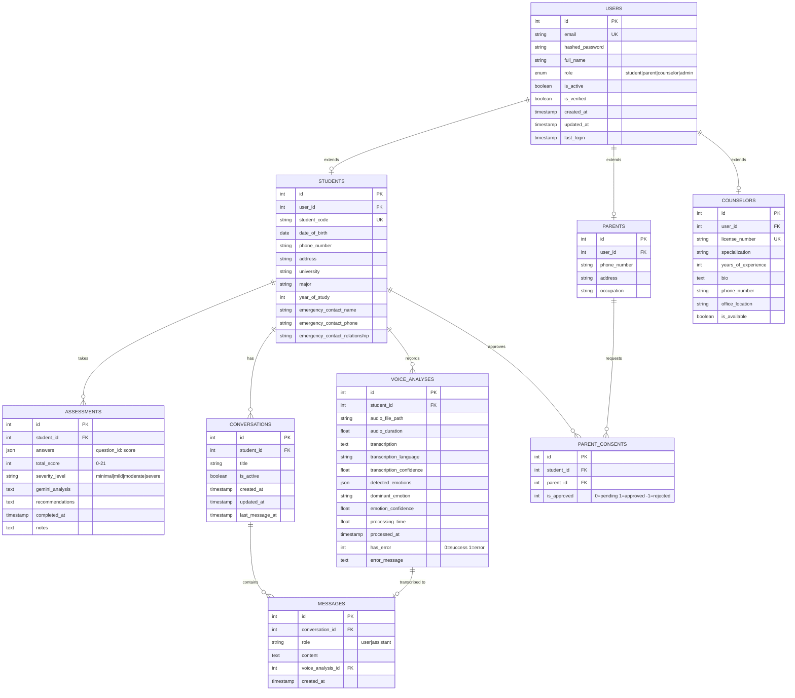

# AI4Mind Database Schema

## Entity Relationship Diagram

### Core Entities

#### 👤 USERS (Authentication)

- **Purpose**: Central authentication table for all user types
- **Key Fields**: email (unique), role (enum), hashed_password
- **Relationships**: 1-to-1 with Students/Parents/Counselors

#### 👨‍🎓 STUDENTS (Extended Profile)

- **Purpose**: Student-specific information
- **Key Fields**: student_code (unique), university, major, year_of_study
- **Relationships**:
  - 1-to-many with Assessments (takes multiple assessments)
  - 1-to-many with Conversations (has multiple chats)
  - 1-to-many with Voice Analyses (records multiple voices)
  - 1-to-many with Parent Consents (approves parent access)

#### 👨‍👩‍👦 PARENTS (Extended Profile)

- **Purpose**: Parent information and occupation
- **Relationships**: 1-to-many with Parent Consents (requests access)

#### 🤝 PARENT_CONSENTS (Privacy Control)

- **Purpose**: Manage parent access to student data
- **Key Fields**: is_approved (0=pending, 1=approved, -1=rejected)
- **Business Rule**: Parent can ONLY view student data if approved=1

#### 👨‍⚕️ COUNSELORS (Professional Profile)

- **Purpose**: Licensed counselor information
- **Key Fields**: license_number (unique), specialization, years_of_experience
- **Access Level**: Can view ALL student data (no consent needed)

### Data Entities

#### 📋 ASSESSMENTS (GAD-7 Results)

- **Purpose**: Store GAD-7 assessment results and AI analysis
- **Key Fields**:
  - answers (JSON): Raw responses {1: 2, 2: 1, ...}
  - total_score (0-21): Sum of all answers
  - severity_level: minimal|mild|moderate|severe
  - gemini_analysis: AI-generated insights
  - recommendations: AI-generated suggestions

#### 💬 CONVERSATIONS (Chat Sessions)

- **Purpose**: Group messages into conversation sessions
- **Key Fields**: title (auto-generated), is_active, last_message_at
- **Relationships**: 1-to-many with Messages

#### 💌 MESSAGES (Individual Messages)

- **Purpose**: Individual chat messages within a conversation
- **Key Fields**: role (user|assistant), content (text)
- **Relationships**:
  - Many-to-1 with Conversations
  - 0-to-1 with Voice Analyses (optional voice link)

#### 🎙️ VOICE_ANALYSES (Voice Processing Results)

- **Purpose**: Store Whisper transcription and emotion detection
- **Key Fields**:
  - audio_file_path: Location of audio file
  - transcription: Text from Whisper
  - detected_emotions (JSON): Emotion scores
  - dominant_emotion: Primary detected emotion
- **Relationships**: 1-to-1 with Messages (optional)

---

## Data Flow Examples

### Flow 1: Student Takes GAD-7 Assessment

```
1. Student submits answers via API
2. Backend calculates total_score
3. Backend calls Gemini API for analysis
4. Save to ASSESSMENTS table:
   - answers: {1: 2, 2: 1, 3: 2, ...}
   - total_score: 12
   - severity_level: "moderate"
   - gemini_analysis: "Bạn đang trải qua..."
   - recommendations: "5 gợi ý cụ thể..."
5. Return results to student
```

### Flow 2: Student Chats with AI

```
1. Student sends message "Tôi stress quá"
2. Backend loads conversation history from MESSAGES
3. Backend calls Gemini API with history
4. Gemini returns response
5. Save 2 messages:
   - Message 1: role="user", content="Tôi stress quá"
   - Message 2: role="assistant", content="Tôi hiểu..."
6. Update conversation.last_message_at
```

### Flow 3: Student Records Voice Message

```
1. Student records audio in browser
2. Upload audio file to AI-Service
3. AI-Service calls Voice-Analysis Service
4. Voice-Analysis:
   - Save audio to shared/audio-files/
   - Run Whisper transcription
   - (Optional) Run emotion detection
   - Return results
5. AI-Service saves to VOICE_ANALYSES table
6. AI-Service creates MESSAGE with transcribed text
7. AI-Service calls Gemini for response
8. Save Gemini response as MESSAGE
9. Link message to voice_analysis_id
```

### Flow 4: Parent Requests Access

```
1. Parent creates account (role=parent)
2. Parent clicks "Request access to child"
3. Backend creates PARENT_CONSENTS:
   - student_id: 1
   - parent_id: 2
   - is_approved: 0 (pending)
4. Student receives notification
5. Student clicks Approve/Reject
6. Backend updates PARENT_CONSENTS:
   - is_approved: 1 (approved) or -1 (rejected)
7. If approved: Parent can now query:
   SELECT * FROM assessments WHERE student_id = 1
```

### Flow 5: Counselor Views Dashboard

```
1. Counselor logs in
2. Backend queries all students with recent assessments:
   SELECT s.*, u.full_name, a.total_score, a.severity_level
   FROM students s
   JOIN users u ON s.user_id = u.id
   LEFT JOIN assessments a ON a.student_id = s.id
   WHERE a.completed_at = (
     SELECT MAX(completed_at) FROM assessments WHERE student_id = s.id
   )
   ORDER BY
     CASE a.severity_level
       WHEN 'severe' THEN 1
       WHEN 'moderate' THEN 2
       WHEN 'mild' THEN 3
       ELSE 4
     END
3. Display students sorted by severity (severe first)
4. Counselor clicks student → view full history
```

---

## Indexes for Performance

```sql
-- Fast user lookup by email
CREATE INDEX idx_users_email ON users(email);

-- Fast student lookup by code
CREATE INDEX idx_students_code ON students(student_code);
CREATE INDEX idx_students_user ON students(user_id);

-- Fast assessment queries
CREATE INDEX idx_assessments_student ON assessments(student_id);
CREATE INDEX idx_assessments_severity ON assessments(severity_level);
CREATE INDEX idx_assessments_completed ON assessments(completed_at DESC);

-- Fast conversation queries
CREATE INDEX idx_conversations_student ON conversations(student_id);
CREATE INDEX idx_conversations_active ON conversations(is_active);

-- Fast message queries
CREATE INDEX idx_messages_conversation ON messages(conversation_id);
CREATE INDEX idx_messages_created ON messages(created_at);

-- Fast voice analysis queries
CREATE INDEX idx_voice_student ON voice_analyses(student_id);
CREATE INDEX idx_voice_processed ON voice_analyses(processed_at DESC);

-- Fast consent queries
CREATE INDEX idx_consents_student ON parent_consents(student_id);
CREATE INDEX idx_consents_parent ON parent_consents(parent_id);
CREATE INDEX idx_consents_approved ON parent_consents(is_approved);
```

---

## Storage Estimates

### For 1000 students over 1 year:

| Table           | Rows    | Avg Size  | Total Size |
| --------------- | ------- | --------- | ---------- |
| users           | 1,200   | 500 bytes | 600 KB     |
| students        | 1,000   | 800 bytes | 800 KB     |
| parents         | 200     | 400 bytes | 80 KB      |
| counselors      | 10      | 600 bytes | 6 KB       |
| parent_consents | 300     | 100 bytes | 30 KB      |
| assessments     | 12,000  | 2 KB      | 24 MB      |
| conversations   | 5,000   | 500 bytes | 2.5 MB     |
| messages        | 100,000 | 500 bytes | 50 MB      |
| voice_analyses  | 10,000  | 1 KB      | 10 MB      |
| **TOTAL**       |         |           | **~87 MB** |

### Audio files (stored separately):

- 10,000 voice recordings × 1 MB avg = 10 GB
- With compression: ~5 GB

**Total Storage Needed: ~5.1 GB** (very manageable!)

---

## Security Considerations

### 1. Row-Level Security (RLS)

```sql
-- Students can only see their own data
CREATE POLICY student_own_data ON assessments
  FOR SELECT
  USING (student_id = current_user_student_id());

-- Parents can only see approved children
CREATE POLICY parent_approved_data ON assessments
  FOR SELECT
  USING (
    student_id IN (
      SELECT student_id FROM parent_consents
      WHERE parent_id = current_user_parent_id()
        AND is_approved = 1
    )
  );

-- Counselors can see all
CREATE POLICY counselor_all_data ON assessments
  FOR SELECT
  USING (current_user_role() = 'counselor');
```

### 2. Sensitive Data Encryption

```python
# Encrypt sensitive fields at application level
from cryptography.fernet import Fernet

# Encrypt before storing
audio_path = encrypt(file_path, key)
assessment.notes = encrypt(notes, key)

# Decrypt when reading
notes = decrypt(assessment.notes, key)
```

### 3. Audit Logging

```sql
-- Track all data access
CREATE TABLE audit_logs (
  id SERIAL PRIMARY KEY,
  user_id INT,
  action VARCHAR(50),
  table_name VARCHAR(50),
  record_id INT,
  created_at TIMESTAMP DEFAULT NOW()
);

-- Log when counselor views student
INSERT INTO audit_logs (user_id, action, table_name, record_id)
VALUES (counselor_id, 'VIEW', 'students', student_id);
```

---

## Backup Strategy

### 1. Daily Backups

```bash
# Automated daily backup at 2 AM
pg_dump -h db.supabase.co -U postgres ai4mind > backup_$(date +%Y%m%d).sql
```

### 2. Point-in-Time Recovery

- Supabase provides automatic point-in-time recovery
- Can restore to any point in last 7 days

### 3. Critical Data Export

```python
# Export critical data to Excel weekly
import pandas as pd

assessments = pd.read_sql("SELECT * FROM assessments", conn)
assessments.to_excel("backup_assessments.xlsx")
```

---

**This database design supports AI4Mind's mission to provide accessible mental health support while maintaining strict privacy and security! 🚀**
