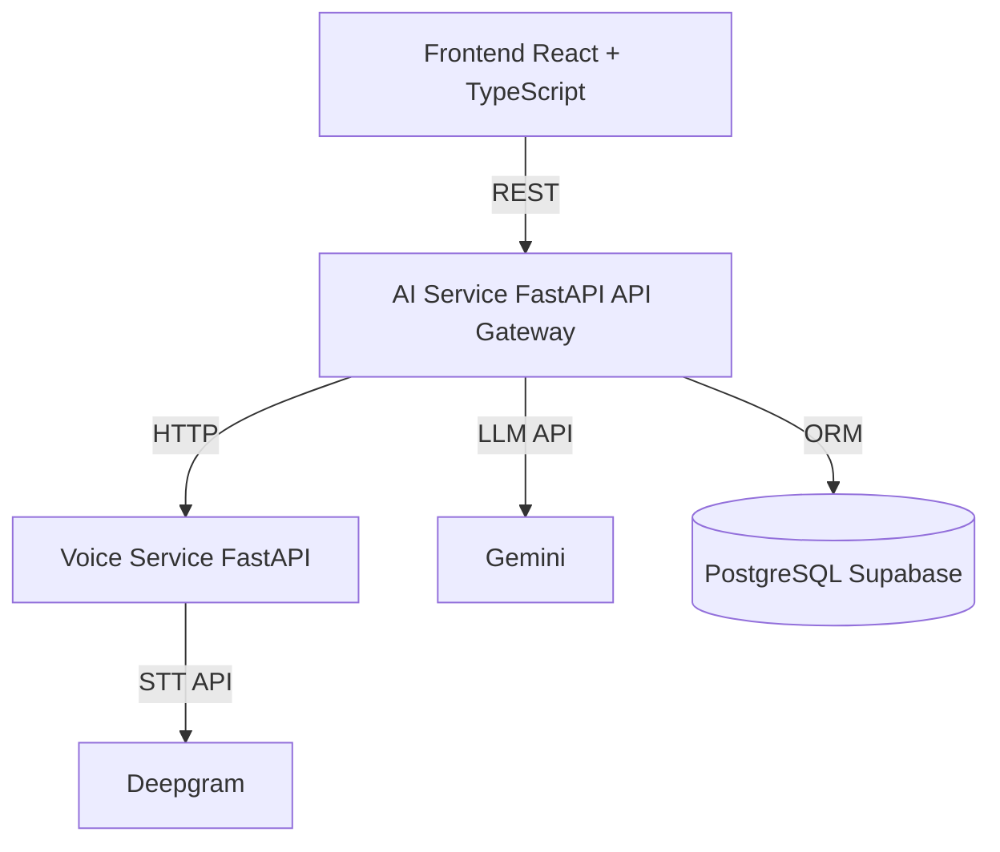

# AI4Mind

AI4Mind is a student mental health screening platform that combines questionnaire scoring, voice analysis, and AI-assisted counseling in one product flow.

[](./frontend)
[](./ai-service)
[](./voice-service)
[](./database)

## Why This Project Exists

In school settings, early stress and anxiety signals are often missed when support depends only on manual check-ins.

I built AI4Mind to make early screening practical by combining:

1. Structured questionnaire scoring.
2. Voice-based behavioral signals.
3. AI-guided conversation support.
4. Role-based dashboards for real operations.

This system supports early detection and referral, not clinical diagnosis.

## What I Actually Built

- A 3-service architecture: React frontend, FastAPI API gateway, and FastAPI voice microservice.
- Role-based workflows for Student, Parent, Counselor, and Admin.
- Parent-child access control using both emergency-contact linkage and explicit consent.
- Voice pipeline that uses external STT with internal feature extraction and emotion analysis.
- Production-oriented baseline: environment config, health endpoints, and testable service boundaries.

## Key Engineering Decisions

1. Split voice processing into a separate service.
Reason: keep heavy audio dependencies isolated from core business APIs and make deployment easier.

2. Use hybrid voice architecture.
Reason: external STT (Deepgram) gives reliable transcription while internal signal processing keeps domain logic in-house.

3. Implement parent authorization as union logic.
Reason: real-life data comes from both emergency contact links and formal consent approval.

## Architecture



## Evidence in Code

- API router composition and domain modules:
  - [ai-service/app/api/v1/api.py](./ai-service/app/api/v1/api.py)
- Parent endpoints (children + child assessments):
  - [ai-service/app/api/v1/endpoints/parents.py](./ai-service/app/api/v1/endpoints/parents.py)
- Parent access guard logic:
  - [ai-service/app/api/dependencies.py](./ai-service/app/api/dependencies.py)
- Parent-aware assessment authorization:
  - [ai-service/app/api/v1/endpoints/assessments.py](./ai-service/app/api/v1/endpoints/assessments.py)
- Role-based frontend routing:
  - [frontend/src/App.tsx](./frontend/src/App.tsx)
- Parent dashboard pages:
  - [frontend/src/pages/ParentDashboardPage/ParentDashboardPage.tsx](./frontend/src/pages/ParentDashboardPage/ParentDashboardPage.tsx)
  - [frontend/src/pages/ParentChildAssessmentsPage/ParentChildAssessmentsPage.tsx](./frontend/src/pages/ParentChildAssessmentsPage/ParentChildAssessmentsPage.tsx)

## Tech Stack

| Layer | Stack |
| --- | --- |
| Frontend | React, TypeScript, Vite, MUI, React Query |
| API Gateway | FastAPI, SQLAlchemy, Alembic, JWT |
| Voice Service | FastAPI, librosa, Deepgram integration |
| AI Integration | Google Gemini API |
| Database | PostgreSQL (Supabase) |
| Tooling | Pytest, ESLint, Prettier, TypeScript checks |

## Current Scope and Gaps

What is working now:

- End-to-end role-based auth and routing.
- Parent visibility into linked child assessments.
- Voice-analysis endpoint integration.

What still needs product hardening:

- Full consent lifecycle UX (request, review, revoke visibility).
- Stronger observability dashboards and alerting.
- Broader standardized assessment sets beyond the current baseline.

## Quick Start (Local)

### 1. Prerequisites

- Python 3.11+
- Node.js 18+
- PostgreSQL (or Supabase)

### 2. Environment

```powershell
Copy-Item .env.example .env
```

Set required keys in `.env`:

- `SUPABASE_DATABASE_URL`
- `JWT_SECRET_KEY`
- `GEMINI_API_KEY`
- `AI_SERVICE_URL`
- `VOICE_SERVICE_URL`

### 3. Run services

```powershell
cd ai-service
pip install -r requirements.txt
alembic upgrade head
uvicorn app.main:app --host 0.0.0.0 --port 8000 --reload

cd ../voice-service
pip install -r requirements.txt
uvicorn app.main:app --host 0.0.0.0 --port 8001 --reload

cd ../frontend
npm install
npm run dev
```

## Validation

```powershell
cd frontend
npm run type-check
npm run build

cd ../ai-service
pytest -q
```

## 5-Minute Reviewer Flow

1. Open API docs at `http://localhost:8000/docs`.
2. Sign in with a Student account and create an assessment.
3. Sign in with a linked Parent account and verify child assessment visibility.
4. Call voice analysis endpoint to validate the multimodal path.

## Component Docs

- AI Service: [ai-service/README.md](./ai-service/README.md)
- Voice Service: [voice-service/README.md](./voice-service/README.md)
- Frontend: [frontend/README.md](./frontend/README.md)

## Responsible Use

AI4Mind is for screening support and care navigation. It is not a replacement for licensed clinical diagnosis or treatment.# AI4Mind

AI-assisted student mental health screening platform built with a full-stack, multi-service architecture.

[](./frontend)
[](./ai-service)
[](./voice-service)
[](./database)

## Recruiter Snapshot

- Designed and integrated 3 services: React frontend, FastAPI API gateway, and FastAPI voice-analysis microservice.
- Implemented role-based workflows for Student, Parent, Counselor, and Admin.
- Built parent-student access control based on emergency-contact linkage and explicit consent.
- Delivered multimodal screening flow: questionnaire + voice analysis + AI chat support.
- Added production-minded practices: environment-based config, health endpoints, and smoke/regression tests.

## Problem and Product Direction

Students with early stress/anxiety signals are often missed when schools rely on one-time manual observation.

AI4Mind addresses this by combining:

1. Standardized questionnaire scoring.
2. Voice-based signals (audio features + emotion analysis).
3. AI-assisted counseling conversation.
4. Role-aware dashboards for school operations.

The platform is intended for early screening and support, not medical diagnosis.

## System Architecture


## Implemented Features (Code Evidence)

- Parent endpoints for linked children and child assessments:
  - [ai-service/app/api/v1/endpoints/parents.py](./ai-service/app/api/v1/endpoints/parents.py)
- Parent access guard (emergency-contact + approved consent union):
  - [ai-service/app/api/dependencies.py](./ai-service/app/api/dependencies.py)
- Assessment authorization filter for parent role:
  - [ai-service/app/api/v1/endpoints/assessments.py](./ai-service/app/api/v1/endpoints/assessments.py)
- Parent routes in frontend app router:
  - [frontend/src/App.tsx](./frontend/src/App.tsx)
- Parent dashboard UI:
  - [frontend/src/pages/ParentDashboardPage/ParentDashboardPage.tsx](./frontend/src/pages/ParentDashboardPage/ParentDashboardPage.tsx)
- Parent child-assessment history UI:
  - [frontend/src/pages/ParentChildAssessmentsPage/ParentChildAssessmentsPage.tsx](./frontend/src/pages/ParentChildAssessmentsPage/ParentChildAssessmentsPage.tsx)

## Tech Stack

| Layer | Stack |
| --- | --- |
| Frontend | React, TypeScript, Vite, MUI, React Query |
| API Gateway | FastAPI, SQLAlchemy, Alembic, JWT auth |
| Voice Service | FastAPI, librosa, Deepgram API integration |
| AI integration | Google Gemini API |
| Database | PostgreSQL (Supabase) |
| Tooling | Pytest, ESLint, Prettier, TypeScript checks |

## Repository Structure

```text
ai4mind-app/
|- ai-service/
|- voice-service/
|- frontend/
|- database/
|- scripts/
`- README.md
```

## Quick Start (Local)

### 1. Prerequisites

- Python 3.11+
- Node.js 18+
- PostgreSQL (or Supabase database)

### 2. Environment

```powershell
Copy-Item .env.example .env
```

Fill required values in `.env`:

- `SUPABASE_DATABASE_URL`
- `JWT_SECRET_KEY`
- `GEMINI_API_KEY`
- `AI_SERVICE_URL`
- `VOICE_SERVICE_URL`

### 3. Run AI Service

```powershell
cd ai-service
pip install -r requirements.txt
alembic upgrade head
uvicorn app.main:app --host 0.0.0.0 --port 8000 --reload
```

### 4. Run Voice Service

```powershell
cd ../voice-service
pip install -r requirements.txt
uvicorn app.main:app --host 0.0.0.0 --port 8001 --reload
```

### 5. Run Frontend

```powershell
cd ../frontend
npm install
npm run dev
```

Open:

- Frontend: http://localhost:3000
- AI Service docs: http://localhost:8000/docs
- Voice Service docs: http://localhost:8001/docs

## Validation and Quality Checks

Frontend checks:

```powershell
cd frontend
npm run type-check
npm run build
```

Backend checks:

```powershell
cd ../ai-service
pytest -q
```

## Component Docs

- AI Service: [ai-service/README.md](./ai-service/README.md)
- Voice Service: [voice-service/README.md](./voice-service/README.md)
- Frontend: [frontend/README.md](./frontend/README.md)

## Responsible Use Note

This project supports early screening and referral. It does not replace licensed clinical diagnosis or treatment.
